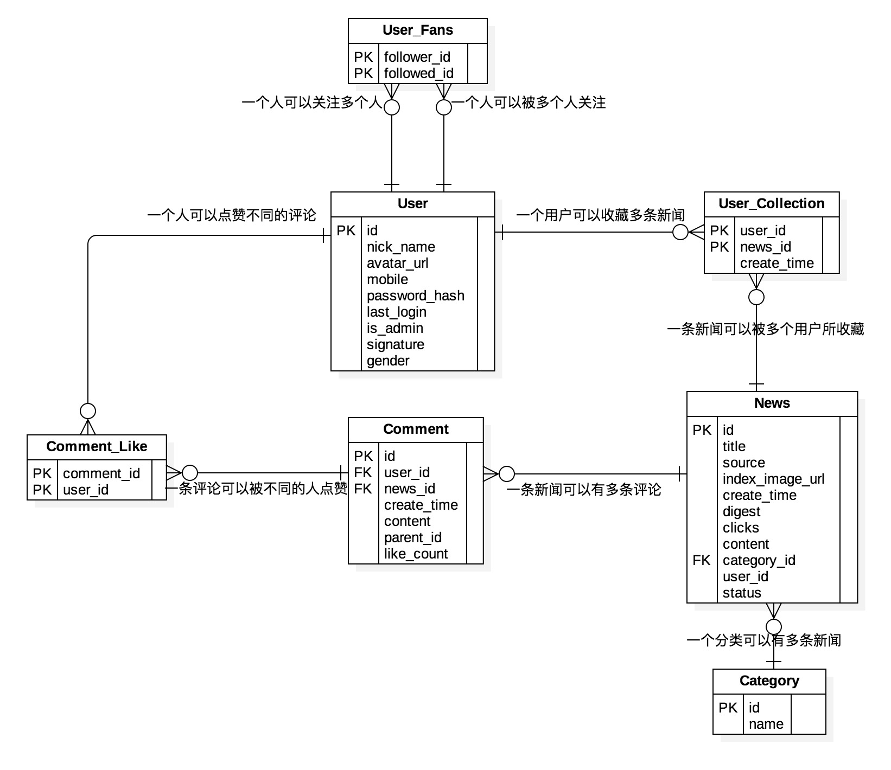

### fastapi结合sqlalchemy 2.x开发的一个异步Web Service应用
- [x] python3.9
- [x] fastapi
- [x] sqlalchemy 2.x

### 异步框架的接口效率分析

### 报错解决
1. ImportError: cannot import name 'field_validator' from 'pydantic'. (pydantic包版本太低导致。升级pydantic包`pip install --upgrade pydantic -i https://pypi.douban.com/simple`)
2. pydantic.errors.PydanticImportError: `BaseSettings` has been moved to the `pydantic-settings` package. See https://docs.pydantic.dev/2.4/migration/#basesettings-has-moved-to-pydantic-settings for more details. （升级pydantic包版本导致。BaseSettings设置类 已移至单独的包 pydantic-settings）

### 项目中疑问解答
1. 为什么fastapi不太适合用类视图？
1.1 函数式编程风格：FastAPI 更倾向于使用函数式编程风格来处理请求。使用函数可以更直观地描述一个端点（endpoint），并允许更灵活地组织代码。

1.2 更清晰的路由定义：使用函数定义路由可以让代码更加清晰易懂。FastAPI 倾向于使用装饰器来标记路由和请求处理函数，而不是类视图中的类方法。

1.3 自动文档生成：FastAPI 依赖于 Python 的类型提示来生成 API 文档。虽然可以在类视图中使用类型提示，但对于 FastAPI 来说，使用函数更容易进行类型提示并生成清晰的文档。

2. 怎样便捷的测试异步接口和同步接口的请求效率？

### 文献参考
1. https://github.com/fastapi-practices/fastapi_sqlalchemy_mysql | https://gitee.com/wu_cl/fastapi_sqlalchemy_mysql
2. https://github.com/kaxiluo/fastapi-skeleton
3. loguru 日志: https://loguru.readthedocs.io/en/stable/api/logger.html#loguru._logger.Logger.add
4. https://www.cnblogs.com/xiao-xue-di/p/15959513.html  （个人感觉fastapi不太适合用类视图）
5. https://docs.sqlalchemy.org/en/20/index.html
6. https://fastapi.tiangolo.com/zh/tutorial/
7. https://docs.pydantic.dev/latest/
8. https://docs.sentry.io/platforms/python/integrations/fastapi/
9. fastapi-pagination 

### 数据库建模分析

